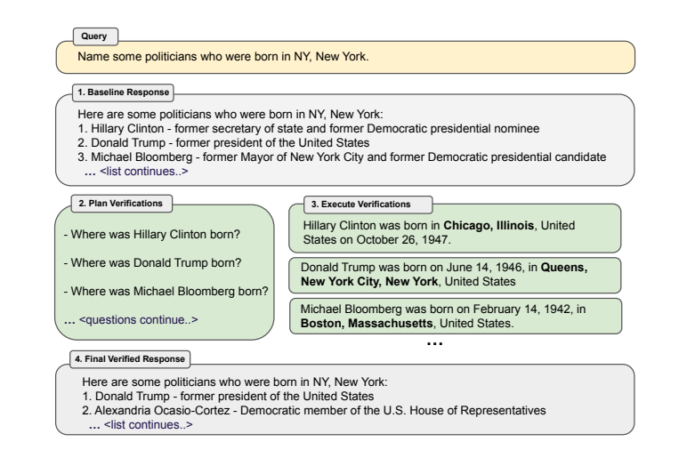

### ORCA MATH
- Slm teacher student model
- improving the reasoning capabilities of SLMs is using frontier language models, such as GPT-4,
- ensembling
- larger amounts of data (e.g. 12M for Phi-GSM) or use tools or code to avoid calculation
errors.
-  Orca-Math-dataset, a synthetic dataset of 200K math problems, paired with GPT-4-Turbo solutions
- iterative learning procedure
- seed set
- Agent - Ask Me Anything
- Agent - Suggester & Editor
- Supervised fine tuning experiment
- Data construction q+ q- from q and preference dataset
- KTO Algo to train model3
- Use model3 to generate answers which are evaluated by gpt4

Dataset->add by numbers->add complexity->model1 mistral fine tuning
->4 answers->model2 kto dpo->answers by model2 evaluated by gpt4

### SELF EXPLORE

### Chain of Verification

1. Generate Baseline Response: Given a query, generate the response using the LLM.
2. Plan Verifications: Given both query and baseline response, generate a list of verification
questions that could help to self-analyze if there are any mistakes in the original response.
3. Execute Verifications: Answer each verification question in turn, and hence check the answer
against the original response to check for inconsistencies or mistakes.(joint, 2-step, factored)
4. Generate Final Verified Response: Given the discovered inconsistencies (if any), generate a
revised response incorporating the verification results
Verification Questions:- Generated by the llm outperform heuristics. Yes/No questions should
be avoided.

### Self-Discover

Discovers the exact thought process required for solving the problem. The model then elaborates
on the thought process and provides a detailed explanation of the solution in a json format.
This is finally used to generate the final response.
Problems with SLMs:- wont understand the difference between the various thought processes

### Deductive verification of cot reasoning

### Step-Back Prompting

### Papers to read
https://arxiv.org/pdf/2404.02255 - decomposition, solution, verification LM2